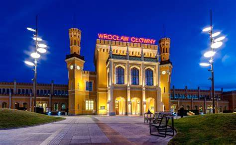

# aktualności
<!DOCTYPE html>
<html>
    <head>
        <meta charset="utf-8">
        <title>testowa.pl</title>
       <link rel="stylesheet" type="text/css" href="main.css">
    </head>
    <body>
    

    

         

         
         
         
         
         
        
  
 
   <label for="toggle">&#9776;</label>
         <input type="checkbox" id="toggle">
         

      <a href="https://witas-w.github.io/Aktualnosci/">Aktualności</a>
            <a href="https://witas-w.github.io/Bloguje-witas/">Blog</a>
            <a href="https://witas-w.github.io/Galeria-zdjec/">Zdjęcia</a>
             <a href="https://witas-w.github.io/Ranking/">Rankingi</a>
             <a href="https://witas-w.github.io/OStatkach/">Statki</a>
     
  
            
    
       
 
        

        <h3 id="akt">Aktualności</h3>
         
Obecnie jestem we Wrocławiu. Miasto położone jest nad kilkoma odnogami Odry. Można w nim obejrzeć ok. 170 mostów i kładek oraz 464 krasnale.

        

       
   
 
  </body>
</html>
